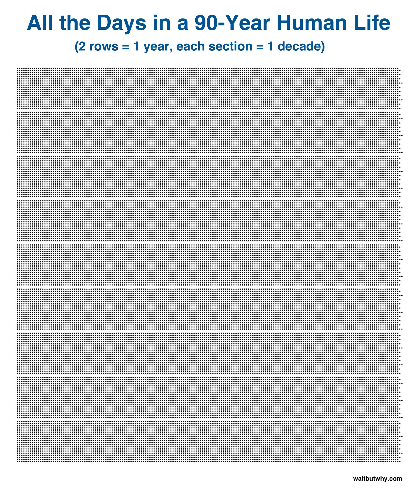

We experience life in days, not hours, weeks, months, or years.

Each day is a story, a miniature version of a human life: it contains a beginning, a middle, and an end.

Each day is an opportunity to rewrite, an opportunity to start telling a new story. 

Or if we're already building a great story, it's an opportunity to build upon the previous chapter, to do something surprising.

Life is short, yes, but it's also full of unscripted potential.

[Yuri Gagarin](https://en.wikipedia.org/wiki/Yuri_Gagarin), over the course of 20 years, went from living in a mud hut to becoming the first human to journey to outer space.

What else is possible??

## 1% of 1 day

If it's too overwhelming to think of all the days in your life, how about just 1% of one day?

15 minutes = 1% of a day.

What could you do for 15 minutes every day for the next year that would make your life better?

One percent. Can you dedicate one percent to that activity?

- 30 minutes = 2% of a day.
- 45 minutes = 3% of a day.
- 1 hour = 4% of a day.

You probably spend 30% of each day sleeping.

What are you doing with the other 70%?

## Who made this?

Hey there! My name is [Raam Dev](https://raamdev.com/about/). 

By day I make the web a better place as a software engineer at [Automattic](https://automattic.com/). 

By night I write on [raamdev.com](https://raamdev.com/). Say hello to [@raamdev](https://twitter.com/raamdev).
